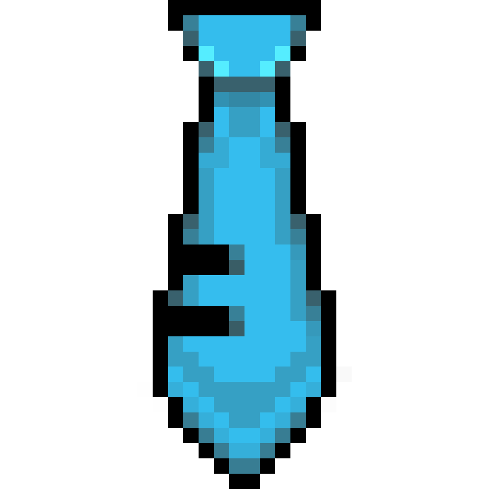

<div align="center">

</div>

# Blue Tie - Hatsune Miku themed discord activity

Customize your discord profile with Hatsune Miku in your activity banner!

**Blue tie** is a windows application that is hiding in your tray consuming minimum CPU resources, with the goal to show
everyone
your **love for Miku**.

### Installation

Application requires Microsoft Visual C++ Redistributable to be present on the system. If your system for some reason doesn't have one, you can install it from [Microsoft page](https://learn.microsoft.com/en-us/cpp/windows/latest-supported-vc-redist?view=msvc-170#latest-microsoft-visual-c-redistributable-version). 

[Download](https://github.com/redinjector/blue-tie/releases) and run the installer, or download and extract portable
version in your preferred location.

### Usage

The application is very easy to use,
it only has 2 buttons and one of them is *Exit* :D

The other button, "Re-roll", changes current quote on the banner to
a new random one.

> ⚠️ Note: Discord may not like it if the banner updates more than 5 times per 20 seconds!

The quote on the banner changes randomly every 1 to 2 minutes. All quotes were taken from famous songs featuring
*Hatsune Miku*!

### Building from source

Before building the application you need to [set up external dependencies](external/README.md).

Once that’s done, just run the following commands from within the project directory:

```
cmake -B build -S . -DCMAKE_BUILD_TYPE=Release
cmake --build build --config Release
```

That's it!

If you want to build the installer you can also run
> ⚠️ This step requires `dotnet` to be present on your system
```
cmake --build build --target prepare_installer --config Release
```
The installer can be found in `installer\bin\Debug`

<div align="center">

</div>
